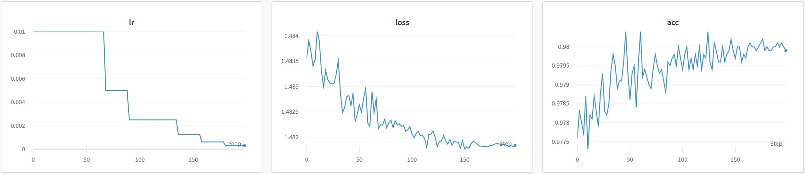

# Классификатор MNIST

В ходе работы создана нейросетевая модель, решающая задачу классификации на датасете MNIST.
Благодаря использованию слоев свертки и пулинга удалось достичь количества параметров, равного 9956, 
и при этом досичь значения точности 0.9804 на тестовой выборке.

# Архитектура модели

Архитектура модели может быть представлена следующим образом:
```
NeuralNetwork(
  (layer1): Sequential(
    (0): Conv2d(1, 3, kernel_size=(3, 3), stride=(1, 1))
    (1): BatchNorm2d(3, eps=1e-05, momentum=0.1, affine=True, track_running_stats=True)
    (2): ReLU()
    (3): MaxPool2d(kernel_size=2, stride=2, padding=0, dilation=1, ceil_mode=False)
  )
  (layer2): Sequential(
    (0): Conv2d(3, 3, kernel_size=(5, 5), stride=(1, 1))
    (1): BatchNorm2d(3, eps=1e-05, momentum=0.1, affine=True, track_running_stats=True)
    (2): ReLU()
    (3): MaxPool2d(kernel_size=2, stride=2, padding=0, dilation=1, ceil_mode=False)
  )
  (layer3): Sequential(
    (0): Flatten(start_dim=1, end_dim=-1)
    (1): Linear(in_features=48, out_features=164, bias=True)
    (2): Dropout(p=0.5, inplace=False)
    (3): ReLU()
    (4): Linear(in_features=164, out_features=10, bias=True)
    (5): Softmax(dim=1)
  )
)
```

В составе модели 2 слоя свертки для сбора признаков и 2 линейных слоя для классификации. Для уменьшения числа параметров после каждого сверточного слоя добавлен слой MaxPooling. Также ля улучшения обучения добавлены слои нормализации и дропаута.

# Обучение

Обучение производилось на числе эпох, равном 150, при размере батча, равном 64. В качестве функции потерь использовалась кросс-энтропия (CrossEntropyLoss). В качетсве метрики использовалась точность (Accuracy). 

В качетстве оптимизатора использовался SGD:
```
optimizer = torch.optim.SGD(model.parameters(), lr=LEARNING_RATE)
```

Начальное значение learning rate установлено 1e-2. Для предотвращения попадания модели на плато добавлен соответствующий планировщик:
```
scheduler = torch.optim.lr_scheduler.ReduceLROnPlateau(optimizer, 'min')
```

Весь код для тренировки размещен в `train.py`.

# Результаты

В ходе обучения содели полученны следующие результаты:
<p align="center">
  
</p>

Так же полученные результаты доступны в отчете W&B:
https://wandb.ai/proektbl-1960/MNIST/reports/MNIST-Classifier--Vmlldzo1NDIxMzY1?accessToken=twkin0r83d13po5tjfkoq69x5k5mgh2oxou0fa9pdsadel6faunt08s86hsc41pr
